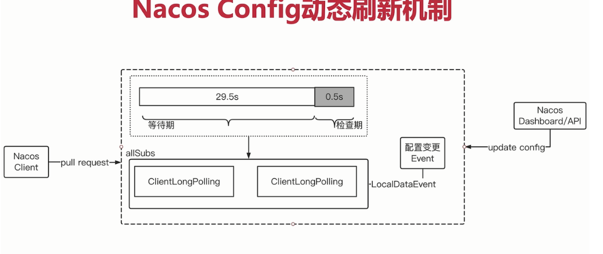
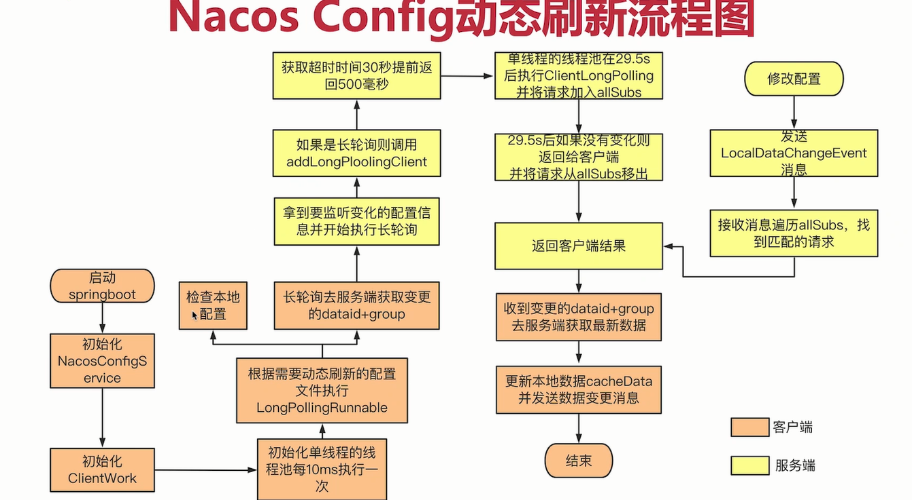

# 01-nacos

## 1. nacos配置

不能直接使用bootstrap.yml（可以使用application.yml）,需要加入以下依赖

```xml
 <dependency>
            <groupId>org.springframework.cloud</groupId>
            <artifactId>spring-cloud-starter-bootstrap</artifactId>
        </dependency>
```

config的优先级

```yml
spring:
  application:
    name: server-name
  cloud:
    nacos:
      discovery:
        server-addr: 127.0.0.1:8848
        service: server-name
      config:
        server-addr: 127.0.0.1:8848
        file-extension: yml
        # 共享的多个配置 及自动刷新配置
        shared-configs[0]:
          dataId: application-dev.yml
          group: DEFAULT_GROUP
          refresh: true
#        shared-configs:
#          - application-dev.yml

        # 自己的配置自动刷新配置
        refresh-enabled: true
        group: DEFAULT_GROUP
        # extension配置
        extension-configs[0]:
          dataId: application-extension.yml
          group: DEFAULT_GROUP
          refresh: true
```

优先级：

server-name-dev.yml > extension-configs> shared-configs


## 2. nacos 动态刷新地址



方式是：长轮询

nacos-client:请求-**长轮询**

30s内：只要有变化就返回，没变化就30s返回


